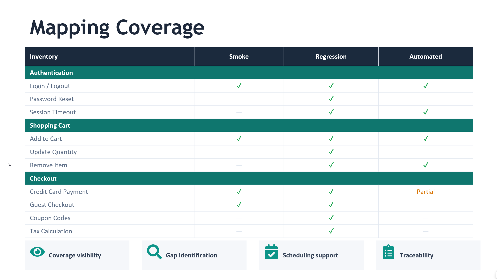
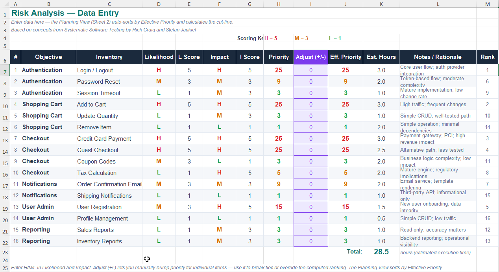
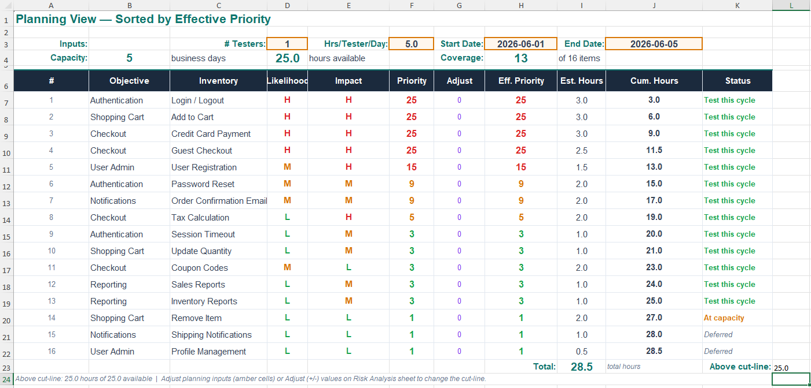
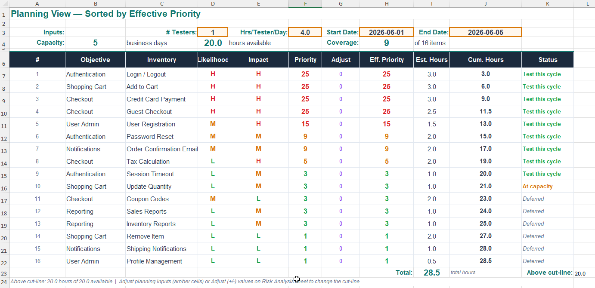

# Risk-Based Test Planning Framework

A lightweight framework for making test coverage, prioritization, and release tradeoffs visible and discussable.

> **Good testing is not about maximum coverage.**
> **It is about communicating risk.**


## The Problem

These conversations happen in every release cycle:

- *"How long does testing take?"* — The answer is unclear or inconsistent across releases.
- *"Can we ship sooner?"* — Nobody can objectively explain what would be cut.
- *"What are we actually testing?"* — Coverage exists as tribal knowledge, not visible artifacts.
- *"What happens if we skip some testing?"* — The associated risks are unclear or unstated.
- *"Why did that defect get through?"* — There is no traceable model showing what was and wasn't covered.

These are not QA problems. They are **visibility problems**.

Testing scope is often defined informally. Priorities are based on intuition. Timelines become difficult to justify. When schedules compress, the tradeoffs are invisible. When defects escape, the coverage gaps are untraceable.

This framework exists to make those discussions visible, objective, and discussable.


## What This Framework Provides

- **Test inventory methodology** — a structured way to identify and organize what requires testing
- **Lightweight risk analysis** — simple Likelihood × Impact scoring that creates shared prioritization
- **Coverage matrix examples** — visible maps of what is tested, where, and where gaps exist
- **Capacity-driven planning** — scheduling based on visible scope and estimated effort
- **Dynamic cut-line modeling** — automatic scope adjustment based on available testing capacity
- **Leadership-oriented communication artifacts** — data that supports release and scheduling discussions


## Core Concepts

| Concept | Definition |
|---|---|
| **Test Objective** | A broad category of functionality or behavior requiring validation |
| **Inventory** | A decomposed list of specific workflows, conditions, or attributes requiring coverage |
| **Risk Priority** | A numeric ranking computed as Likelihood × Impact |
| **Coverage Matrix** | A map of inventories to test suites — showing what is covered, where, and what gaps exist |
| **Cut-Line** | The threshold that separates items tested this cycle from items explicitly deferred |
| **Accepted Risk** | Deferred scope that has been made intentional, visible, owned, and subject to review |

These terms form the shared vocabulary for scheduling and release conversations.

## How It Works

```
Step 1 — Build Test Inventories
  Identify what needs testing.
  Decompose broad objectives into specific, schedulable coverage areas.

Step 2 — Prioritize by Risk
  For each inventory item, assess Likelihood of failure and Impact of failure.
  Score each: High = 5, Medium = 3, Low = 1.
  Compute: Likelihood × Impact = Priority.

Step 3 — Estimate Testing Effort
  Assign approximate execution time to each inventory item.
  This does not need to be precise — it needs to be discussable.

Step 4 — Apply Schedule Capacity
  Available QA capacity (testers × hours × days) determines what fits above the cut-line.
  Items above the cut-line are tested this cycle.
  Items below the cut-line are explicitly deferred.

Step 5 — Communicate Tradeoffs
  Deferred scope becomes visible accepted risk.
  The conversation shifts from:
    "we need more time"
  to:
    "here are the highest-priority items,
    here is the estimated effort,
    and here is the deferred scope and associated risk."
```

The cut-line moves dynamically based on available testing capacity. When schedules or staffing change, the impact on coverage becomes immediately visible.

## Example Workflow

### Coverage Matrix

The coverage matrix shows what is tested, where, and what gaps exist.

| Inventory | Smoke | Regression | Automated |
|---|---|---|---|
| Login / Logout | ✓ | ✓ | ✓ |
| Credit Card Payment | ✓ | ✓ | Partial |
| Guest Checkout | ✓ | ✓ | — |
| Coupon Codes | — | ✓ | — |
| Tax Calculation | — | ✓ | — |


> *Coverage matrix from the planning spreadsheet — showing inventories mapped to smoke, regression, and automation suites, with gaps highlighted.*

### Risk Analysis Table

The risk analysis table ranks inventories by computed priority.

| Inventory | Likelihood | Impact | Priority | Est. Hours | Cumulative |
|---|---|---|---|---|---|
| Login / Logout | H | H | 25 | 3.0 | 3.0 |
| Add to Cart | H | H | 25 | 3.0 | 6.0 |
| Credit Card Payment | H | H | 25 | 3.0 | 9.0 |
| Guest Checkout | H | H | 25 | 2.5 | 11.5 |
| User Registration | M | H | 15 | 1.5 | 13.0 |
| Password Reset | M | M | 9 | 2.0 | 15.0 |
| Tax Calculation | L | H | 5 | 2.0 | 17.0 |
| Coupon Codes | M | L | 3 | 2.0 | — |
| Remove Item | L | L | 1 | 1.0 | — |


> *Risk analysis table from the planning spreadsheet — showing Likelihood, Impact, computed Priority, estimated hours, and cumulative hours with the cut-line visible.*

### Planning View

The planning view shows total capacity, cumulative estimated effort, and the cut-line position.


> *Planning view — showing available capacity inputs (testers, hours/day, date range), the sorted inventory list with cumulative hours, and the dynamic cut-line indicating what fits within the schedule.*

### Dynamic Cut-Line Adjustment

When a schedule changes, the cut-line moves. The tradeoff is immediately visible.


> *Before/after comparison showing the cut-line shifting when available capacity is reduced — with the newly deferred items highlighted and labeled as accepted risk.*

## Repository Contents

```
/docs          — Source materials: leadership deck, risk analysis deck,
                 test analysis and design deck, planning spreadsheet template
/screenshots   — Screenshot images used in this file
```

### What Is in /docs

| File | Description |
|---|---|
| `Leadership_Overview.pptx` | Introduction to the framework for engineering managers, release managers, and product stakeholders |
| `Risk_Analysis.pptx` | Step-by-step guide to running a risk analysis session with your team |
| `Test_Analysis_and_Design.pptx` | Guide to building test inventories and coverage matrices |
| `Risk_Analysis_Template.xlsx` | Planning spreadsheet with risk scoring, auto-sorted priority view, and dynamic cut-line calculation |

## Intended Audience

This framework is designed for:

- **QA engineers and leads** building visible, discussable coverage plans
- **Engineering managers** who need objective data for scheduling decisions
- **Release managers** who need to explain what was tested and what was not
- **Product managers** who participate in scope and risk conversations
- **Organizations** struggling with unpredictable testing timelines and release confidence


This framework is not intended to replace existing QA tooling, agile workflows, or release processes. It is a lightweight operational layer that helps teams make testing scope, prioritization, and tradeoffs visible.


## Design Philosophy

This framework is intentionally lightweight.

### Simplicity over precision
The risk scores do not need to be mathematically rigorous. They need to be shared and discussable. A team that agrees a feature is "High Likelihood / High Impact" has already done the important work.

### Visibility over bureaucracy
The artifacts are operational tools, not compliance documents. A coverage matrix actively used in planning discussions is more valuable than a detailed test plan nobody references.

### Discussable data over tribal knowledge
When coverage is invisible, scheduling conversations become negotiations driven by intuition. When coverage is visible, the conversation becomes objective.

### Human judgment still matters
Computed priority scores are a starting point. Historical defect data, recent code changes, team experience, and existing automation coverage all influence how priorities get adjusted. The framework creates structure for that judgment — it does not replace it.

The goal is not to formalize testing.

The goal is to make testing visible, explainable, and discussable.


## Attribution

This framework is based on concepts from **[Systematic Software Testing](https://www.amazon.com/Systematic-Software-Testing-Rick-Craig/dp/1580535089)** by Rick Craig and Stefan Jaskiel. Their treatment of risk-based test planning, test objectives, and coverage analysis forms the conceptual foundation of the process described here.

The materials in this repository represent a modernized and adapted interpretation of those concepts — updated for contemporary team structures and focused on producing operational artifacts that support scheduling and release communication.

Content authored by Gary McNickle.

## License

Documentation and framework materials in this repository are licensed under [CC BY 4.0](LICENSE-CC-BY.md). You are free to use, share, and adapt the materials with attribution.

